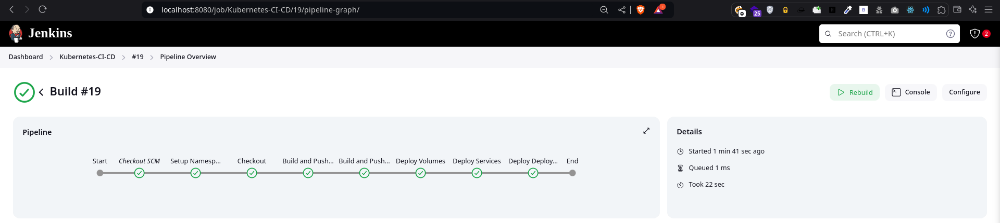
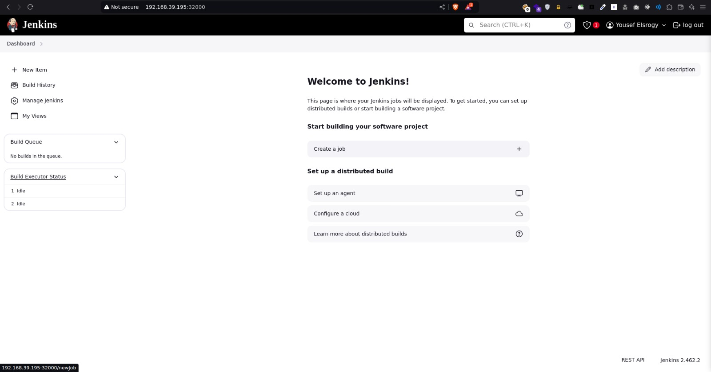
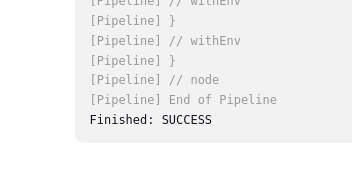

### Kubernetes Jenkins Project

**Project Structure**

```
├── cluster-role-binding.yaml
├── cluster-role.yaml
├── deploymens.yaml
├── Dockerfile.jenkins
├── image.png
├── Jenkinsfile
├── jenkins-role.yaml
├── pv.yaml
├── README.md
├── role-binding.yaml
└── service.yaml
```

Create a Namespace for Jenkins.

```
kubectl create namespace jenkins
```

Deploy the jenkins setup

```
kubect apply -f .
```

SUCCESS!





