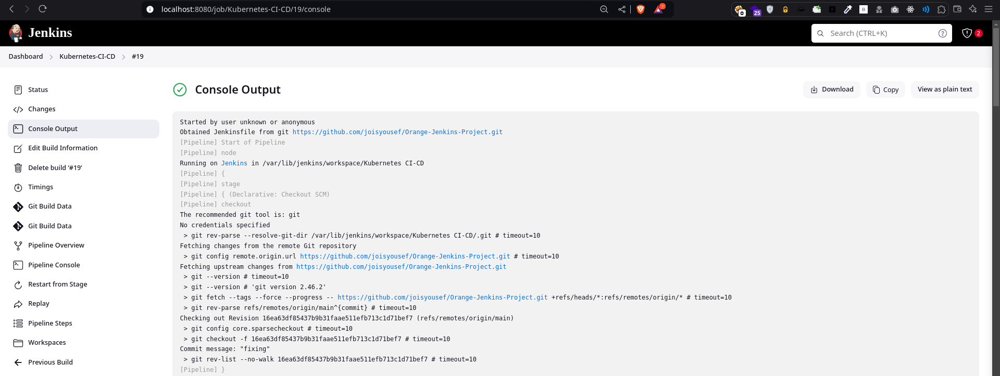

### Kubernetes Jenkins Project

Create a Namespace for Jenkins.

```
kubectl create namespace devops-tools
```

Deploy the jenkins setup

```
kubect apply -f .
```


**Deploy the application**: Apply the YAML files to deploy the proxy, backend, and database:
```
kubectl apply -f Deployments/Backend-Deployment.yaml
kubectl apply -f Deployments/Proxy-Deployment.yaml
kubectl apply -f Deployments/Database-Deployment.yaml
kubectl apply -f Services/Backend-Service.yaml
kubectl apply -f Services/Nodeport.yaml
kubectl apply -f Services/Database-Service.yaml
kubectl apply -f Volumes/Database-pv.yaml
kubectl apply -f Volumes/Database-pvc.yaml
kubectl apply -f Volumes/Database-Secret.yaml
```


